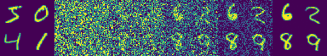

### Diffusion Models From Scratch

March 2023.

---

My notes for this repository ended up longer than expected, too long to be rendered by GitHub.

So instead of putting notes here, they've been moved to my website.

[[**This blog post**]](https://www.tonyduan.com/diffusion/index.html) explains the intuition and derivations behind diffusion.

---

This codebase provides a *minimalist* re-production of the MNIST example below.

It clocks in at well under 500 LOC.

<p align="center">

</p>

(Left: MNIST groundtruth. Right: MNIST sampling starting from random noise).

---

**Example Usage**

Code below is copied from `examples/ex_mnist_simple.py`, omitting boilerplate training code.

```python
    # Initialization
    nn_module = UNet(in_dim=1, embed_dim=128, dim_scales=(1, 2, 4, 8))
    model = DiffusionModel(
        nn_module=nn_module,
        input_shape=(1, 32, 32,),
        config=DiffusionModelConfig(
            num_timesteps=500,
            target_type="pred_x_0",
            gamma_type="ddim",
            noise_schedule_type="cosine",
        ),
    )

    # Training Loop
    for i in range(args.iterations):
        loss = model.loss(x_batch).mean()
        loss.backward()

    # Sampling, the number of timesteps can be less than T to accelerate
    samples = model.sample(bsz=64, num_sampling_timesteps=None, device="cuda")
```
