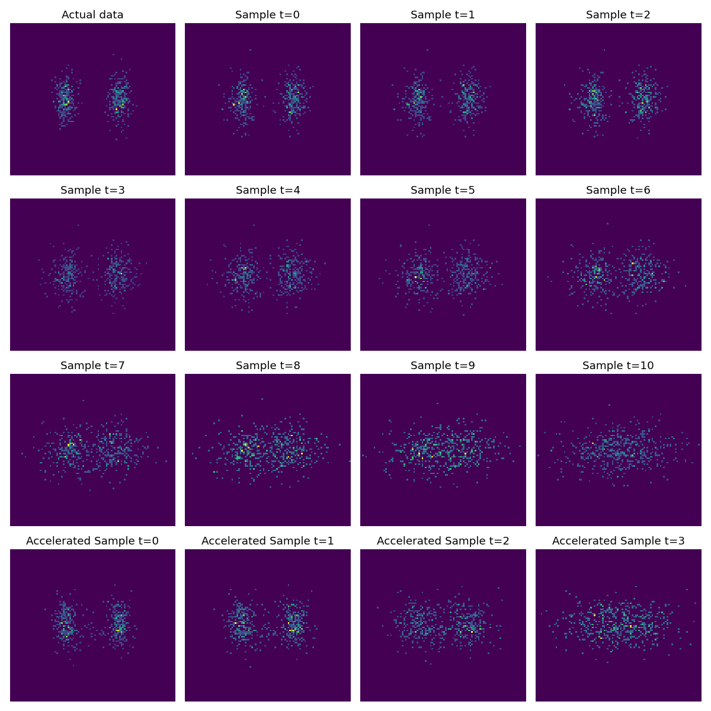

### Diffusion Models From Scratch

March 2023.

---

My notes for this repository ended up longer than expected, too long to be rendered by GitHub.

So instead of putting notes here, they've been moved to my website.

[[**This blog post**]](https://www.tonyduan.com/diffusion.html) explains the intuition and derivations behind diffusion.

The code here likely won't make much sense without reading it.

---

This codebase provides a *minimalist* re-production of the MNIST example below.

It clocks in at well under 500 LOC.

<p align="center">

</p>

(Left: MNIST groundtruth. Right: MNIST sampling starting from random noise).

Another simple example implemented in this repository is diffusion for a mixture of two Gaussians below.

We can validate that accelerated sampling is much faster but maintains reasonable results.



---

**Example Usage**

Code below is copied from the MNIST file in the `examples/` directory, omitting boilerplate training code.

```python
    # Initialization
    nn_module = UNet(in_dim=1, embed_dim=128, dim_scales=(1, 2, 4, 8))
    model = DiffusionModel(
        num_timesteps=500,
        nn_module=nn_module,
        input_shape=(1, 32, 32,),
        config=DiffusionModelConfig(
            target_type="pred_x_0",
            sigma_type="upper_bound",
            noise_schedule_type="cosine",
            loss_type="l2",
        ),
    )

    # Training Loop
    for i in range(args.iterations):
        loss = model.loss(x_batch).mean()
        loss.backward()

    # Sampling, the number of timesteps can be less than T to accelerate
    samples = model.sample(bsz=64, sampling_timesteps=None, device="cuda")
```

---

#### References

1. Ho, J., Jain, A. & Abbeel, P. Denoising Diffusion Probabilistic Models. in *Advances in Neural Information Processing Systems* vol. 33 6840-6851 (2020).
2. Kingma, D. P. & Welling, M. Auto-Encoding Variational Bayes. in *International Conference on Learning Representations* (2014).
3. Nichol, A. Q. & Dhariwal, P. Improved Denoising Diffusion Probabilistic Models. in *Proceedings of the 38th International Conference on Machine Learning* 8162-8171 (PMLR, 2021)
4. Sohl-Dickstein, J., Weiss, E., Maheswaranathan, N. & Ganguli, S. Deep Unsupervised Learning using Nonequilibrium Thermodynamics. in *Proceedings of the 32nd International Conference on Machine Learning* 2256-2265 (PMLR, 2015).
5. Song, J., Meng, C. & Ermon, S. Denoising Diffusion Implicit Models. in *International Conference on Learning Representations* (2021).
6. Vaswani, A. *et al.* Attention is All you Need. in *Advances in Neural Information Processing Systems 30* (eds. Guyon, I. et al.) 5998-6008 (Curran Associates, Inc., 2017).
