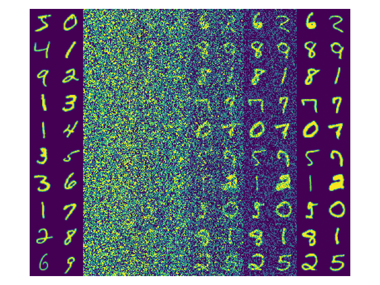

### Diffusion Models From Scratch

February 2023.

---



Here I'll cover the derivations and code from scratch to provide a rigorous understanding of the core ideas. Specifically, everything necessary to reproduce the MNIST example above. Any errors are mine.

#### Contents

1. Structure
2. The Backward Model
3. The Forward Model
4. Training
5. Accelerated Sampling

[[Codebase]](github.com/tonyduan/diffusion)

#### Key Results

Structure

$$
\begin{align*}
L_\theta(\mathbf{x}_0)& = \underbrace{\mathbb{E}_{q(\mathbf{x}_1|\mathbf{x}_0)}\left[\log p_\theta(\mathbf{x}_0|\mathbf{x}_1)\right]}_{L_1} - \sum_{t>1} \underbrace{\mathbb{E}_{q(\mathbf{x}_t|\mathbf{x}_0)}\left[D_\mathrm{KL}(\ q(\mathbf{x}_{t-1}|\mathbf{x}_t, \mathbf{x}_0)\ \|\ p_\theta(\mathbf{x}_{t-1}|\mathbf{x}_t)\ )\right]}_{L_t}
\end{align*}
$$

The Backward Model

$$
\begin{align*}
q(\mathbf{x}_t|\mathbf{x}_{t-1}) & = N(\sqrt{\alpha_t}\mathbf{x}_{t-1}, \beta_t \mathbf{I})\\
q(\mathbf{x}_t| \mathbf{x}_{0}) & = N(\sqrt{\bar{\alpha}_t} \mathbf{x}_0, (1-\bar\alpha_t) \mathbf{I})\\
q(\mathbf{x}_{t-1}|\mathbf{x}_t,\mathbf{x}_0) & = N\left(\frac{\sqrt{\bar\alpha_{t-1}}\beta_t}{1-\bar\alpha_t} \mathbf{x}_0+ \frac{\sqrt{\alpha_t}(1-\bar\alpha_{t-1})}{1-\bar\alpha_t}\mathbf{x}_t,\frac{1-\bar\alpha_{t-1}}{1-\bar\alpha_t}\beta_t\mathbf{I}\right)
\end{align*}
$$

The Forward Model

$$
\begin{align*}
p_\theta(\mathbf{x}_{t-1}|\mathbf{x}_t) & = N\left(\ \mu_\theta(\mathbf{x}_t, t), \sigma_t^2 I\ \right)\\
L_t(\mathbf{x}_0) & \propto \frac{1}{2\sigma_t^2}\mathbb{E}_{q(\mathbf{x}_t|\mathbf{x}_0)}\left\|\underbrace{\frac{\sqrt{\bar{\alpha}_{t-1}}\beta_t}{1-\bar{\alpha}_t}\mathbf{x}_0 +\frac{\sqrt{\alpha_t}(1-\bar\alpha_{t-1})}{1-\bar\alpha_t}\mathbf{x}_t}_{\text{true mean}} - \underbrace{\mu_\theta(\mathbf{x}_t, t) }_\text{predicted mean}\right\|^2\\
\end{align*}
$$

---

#### I. Structure

A diffusion model hypothesizes an observed variable $\mathbf{x}_0$ and latent variables $\mathbf{x}_1,\dots,\mathbf{x}_T$ arranged in the following graphical model.

$$
\begin{equation*}
\mathbf{x}_T \rightarrow \dots \rightarrow \mathbf{x}_{t} \rightarrow \mathbf{x}_{t-1} \rightarrow \dots \rightarrow \mathbf{x}_1 \rightarrow \mathbf{x}_0
\end{equation*}
$$

We assume the following forward and backward models respectively.

$$
\begin{align*}
p_\theta(\mathbf{x}_{0:T}) & = p(\mathbf{x}_T)\prod_t p_\theta(\mathbf{x}_{t-1}|\mathbf{x}_t), \quad p(\mathbf{x}_T) = N(\mathbf{0}, \mathbf{I})\\
q(\mathbf{x}_{1:T}|\mathbf{x}_0) & = \prod_t q(\mathbf{x}_t|\mathbf{x}_{t-1})
\end{align*}
$$

In later sections we'll define specific distributional assumptions. But for now it suffices to note the following.

**Remark**. The backward model $q(\mathbf{x}_{1:T}|\mathbf{x}_0)$ is *fixed*. All learnable parameters lie in the forward model $p_\theta(\mathbf{x}_{t-1}|\mathbf{x}_t)$.

---

As with any latent-variable model, the training objective is to maximize marginal log-likelihood.

$$
\begin{align*}
\log p_\theta(\mathbf{x}_0) & = \int_{\mathbf{x}_{1:T}}\log p_\theta(\mathbf{x}_0,\mathbf{x}_{1:T})d\mathbf{x}_{1:T}
\end{align*}
$$

But this is intractable to compute. Instead we'll maximize the Evidence Lower Bound (ELBO) which arises from Jensen's inequality.

$$
\begin{align*}
\log p_\theta(\mathbf{x}_0) & = \log \int_{\mathbf{x}_{1:T}} p_\theta(\mathbf{x}_0,\mathbf{x}_{1:T})d\mathbf{x}_{1:T}\\
& = \log \int_{\mathbf{x}_{1:T}}q(\mathbf{x}_{1:T}|\mathbf{x}_0)\frac{p_\theta(\mathbf{x}_0,\mathbf{x}_{1:T})}{q(\mathbf{x}_{1:T}|\mathbf{x}_0)}d\mathbf{x}_{1:T}\\
& \geq \int_{\mathbf{x}_{1:T}}q(\mathbf{x}_{1:T}|\mathbf{x}_0)\log \frac{p_\theta(\mathbf{x}_0,\mathbf{x}_{1:T})}{q(\mathbf{x}_{1:T}|\mathbf{x}_0)}d\mathbf{x}_{1:T} \triangleq L_\theta(\mathbf{x}_0)
\end{align*}
$$

**Result**. The gap between the marginal log-likelihood and the ELBO is exactly the KL divergence between the true forward model posterior $p_\theta(\mathbf{x}_{1:T}|\mathbf{x}_0)$ (which is intractable) and the hypothesized backward model $q(\mathbf{x}_{1:T}|\mathbf{x}_0)$. So by maximizing the ELBO we're optimizing how well we approximate the hypothesized backward model.

**Proof**. Let's compute the gap between the marginal likelihood and the ELBO.

$$
\begin{align*}
\log p_\theta(\mathbf{x_0}) - L_{\theta}(\mathbf{x_0})
& = \log \int_{\mathbf{x}_{1:T}} p_\theta(\mathbf{x}_0,\mathbf{x}_{1:T}) d\mathbf{x}_{1:T} -  \int_{\mathbf{x}_{1:T}} q(\mathbf{x}_{1:T}|\mathbf{x}_0) \log \frac{p_\theta(\mathbf{x}_0)p_\theta(\mathbf{x}_{1:T}|\mathbf{x}_0)}{q(\mathbf{x}_{1:T}|\mathbf{x}_0)}d\mathbf{x}_{1:T}\\
& = \log \int_{\mathbf{x}_{1:T}} p_\theta(\mathbf{x}_{1:T}|\mathbf{x}_0) d\mathbf{x}_{1:T} + \log p_\theta(\mathbf{x}_0) -\\& \quad\quad\quad  \int_{\mathbf{x}_{1:T}} q_\phi(\mathbf{x}_{1:T}|\mathbf{x}_0) \log \frac{p_\theta(\mathbf{x}_{1:T}|\mathbf{x}_0)}{q_\phi(\mathbf{x}_{1:T}|\mathbf{x}_0)}d\mathbf{x}_{1:T} - \log p_\theta(\mathbf{x}_0)\\
& = \log \int_{\mathbf{x}_{1:T}} p_\theta(\mathbf{x}_{1:T}|\mathbf{x}_0) d\mathbf{x}_{1:T}  -  \int_{\mathbf{x}_{1:T}} q_\phi(\mathbf{x}_{1:T}|\mathbf{x}_0) \log \frac{p_\theta(\mathbf{x}_{1:T}|\mathbf{x}_0)}{q_\phi(\mathbf{x}_{1:T}|\mathbf{x}_0)}d\mathbf{x}_{1:T} \\
& = D_\mathrm{KL}(\ q_\phi(\mathbf{x}_{1:T}|\mathbf{x}_0)\ \|\ p_\theta(\mathbf{x}_{1:T}|\mathbf{x}_0)\ ) \geq 0
\end{align*}
$$

On the last line above we invoked the non-negativity of KL divergence.

---

From the structure of the graphical model assumed, we will be able to simplify the ELBO into a convenient form.

$$
\begin{align*}
L_\theta(\mathbf{x}_0) & = \int_{q(\mathbf{x}_{1:T}|\mathbf{x}_0)} \prod_{t=1}^Tq(\mathbf{x}_t|\mathbf{x}_{t-1}) \log \frac{p(x_T)\prod_{t} p_\theta(\mathbf{x}_{t-1}|\mathbf{x}_t)}{\prod_{t} q(\mathbf{x}_t|\mathbf{x}_{t-1})}d\mathbf{x}_{1:T}\\
& = \mathbb{E}_{q(\mathbf{x}_{1:T}|\mathbf{x}_0)}\left[\log p(\mathbf{x}_T) + \sum_{t} \log p_\theta(\mathbf{x}_{t-1}|\mathbf{x}_t) -\sum_{t}\log q(\mathbf{x}_t|\mathbf{x}_{t-1}) \right]\\
& = \mathbb{E}_{q(\mathbf{x}_{1:T}|\mathbf{x}_0)}\left[\log p(\mathbf{x}_T) + \sum_{t>1} \log \frac{p_\theta(\mathbf{x}_{t-1}|\mathbf{x}_t)}{q(\mathbf{x}_t|\mathbf{x}_{t-1})} + \log \frac{p_\theta(\mathbf{x}_0|\mathbf{x}_1)}{q(\mathbf{x}_1|\mathbf{x}_0)}\right]\\
& = \mathbb{E}_{q(\mathbf{x}_{1:T}|\mathbf{x}_0)}\left[\log p(\mathbf{x}_T) + \sum_{t>1} \log \frac{p_\theta(\mathbf{x}_{t-1}|\mathbf{x}_t)}{q(\mathbf{x}_{t-1}|\mathbf{x}_t,\mathbf{x}_0)}\frac{q(\mathbf{x}_{t-1}|\mathbf{x}_0)}{q(\mathbf{x}_t|\mathbf{x}_0)} + \log \frac{p_\theta(\mathbf{x}_0|\mathbf{x}_1)}{q(\mathbf{x}_1|\mathbf{x}_0)}\right]\\
& = \mathbb{E}_{q(\mathbf{x}_{1:T}|\mathbf{x}_0)}\left[\log \frac{p(\mathbf{x}_T)}{q(\mathbf{x}_T|\mathbf{x}_0)} + \sum_{t>1} \log \frac{p_\theta(\mathbf{x}_{t-1}|\mathbf{x}_t)}{q(\mathbf{x}_{t-1}|\mathbf{x}_t,\mathbf{x}_0)} + \log p_\theta(\mathbf{x}_0|\mathbf{x}_1)\right]\\
& = \mathbb{E}_{q(\mathbf{x}_{1:T}|\mathbf{x}_0)}\left[\log p_\theta(\mathbf{x}_0|\mathbf{x}_1) - \sum_{t>1} D_\mathrm{KL}(\ q(\mathbf{x}_{t-1}|\mathbf{x}_t, \mathbf{x}_0)\ \|\ p_\theta(\mathbf{x}_{t-1}|\mathbf{x}_t)\ )\right] - D_\mathrm{KL}(\ q(\mathbf{x}_T|\mathbf{x}_0)\ \|\ p(\mathbf{x}_T)\ ) \\
& \propto \mathbb{E}_{q(\mathbf{x}_{1:T}|\mathbf{x}_0)}\left[\log p_\theta(\mathbf{x}_0|\mathbf{x}_1) - \sum_{t>1} D_\mathrm{KL}(\ q(\mathbf{x}_{t-1}|\mathbf{x}_t, \mathbf{x}_0)\ \|\ p_\theta(\mathbf{x}_{t-1}|\mathbf{x}_t)\ ) \right]\\
& = \underbrace{\mathbb{E}_{q(\mathbf{x}_1|\mathbf{x}_0)}\left[\log p_\theta(\mathbf{x}_0|\mathbf{x}_1)\right]}_{L_1} - \sum_{t>1} \underbrace{\mathbb{E}_{q(\mathbf{x}_t|\mathbf{x}_0)}\left[D_\mathrm{KL}(\ q(\mathbf{x}_{t-1}|\mathbf{x}_t, \mathbf{x}_0)\ \|\ p_\theta(\mathbf{x}_{t-1}|\mathbf{x}_t)\ )\right]}_{L_t}
\end{align*}
$$

On the fourth line above we applied

1. Markov property $q(\mathbf{x}_t|\mathbf{x}_{t-1}) = q(\mathbf{x}_t|\mathbf{x}_{t-1}, \mathbf{x}_0)$.
2. Bayes' Rule $q(\mathbf{x}_t|\mathbf{x}_{t-1},\mathbf{x}_0) = \frac{q(\mathbf{x}_{t-1}|\mathbf{x}_t,\mathbf{x}_0)q(\mathbf{x}_t|\mathbf{x}_0)}{q(\mathbf{x}_{t-1}|\mathbf{x}_0)}$.

On the seventh line we used the fact that there are no learnable parameters in the expression $D_\mathrm{KL}(\ q(\mathbf{x}_T|\mathbf{x}_0)\ \|\ p(\mathbf{x}_T)\ )$.

The last line is important because it makes the expectations explicit (for whatever reason most references I find online omit this detail, which I find crucial for understanding). It makes the following result easy to see.

**Result**. Each individual term in the ELBO relies only on *factorized* conditional distributions $q(\mathbf{x}_t|\mathbf{x}_0)$ instead of the joint $q(\mathbf{x}_{1:T}|\mathbf{x}_0)$.

This is important because we'll later optimize the ELBO via Monte Carlo gradient estimates over these expectations. That is, the algorithm will look something like the following.

```python
def compute_L_t(x_0, t):
    monte_carlo_x_t = sample q(x_t | x_0)
    true_distn = get_gt(monte_carlo_x_t, x_0)
    pred_distn = get_pred(monte_carlo_x_t)  # gradient flows into model here
    loss = kl_div(true_distn, pred_distn)
    return loss
```

This is similar to the training procedure for a variational auto-encoder. The re-parameterization trick is not even strictly necessary because there are no learnable parameters in $q(\mathbf{x}_t|\mathbf{x}_0)$.

**Remark**. Diffusion models do not admit tractable log-likelihood evaluation due to the inability to marginalize over latent variables $\mathbf{x}_{1:T}$.

This puts it in the same class as variational auto-encoders. In contrast, autoregressive models and normalizing flows admit tractable log-likelihoods. For comparison to such likelihood-based generative models, Ho et al. report metrics in terms of the ELBO.

---

#### II. The Backward Process

As we will see, how we define $q(\mathbf{x}_t|\mathbf{x}_{t-1})$ will be the key to deriving several properties.

**Define**. The backward process is the following.

$$
\begin{align*}
q(\mathbf{x}_t|\mathbf{x}_{t-1}) & = N(\sqrt{\alpha_t}\mathbf{x}_{t-1}, \beta_t \mathbf{I})\\
\alpha_t & \triangleq 1- \beta_t\\
\bar\alpha_t & \triangleq \prod_{s=1}^t \alpha_s
\end{align*}
$$

To guide intuition, a typical choice is linearly increasing $\beta_1=10^{-4} \rightarrow\beta_T=2 \times 10^{-2}$.

The interpretation of $q(\mathbf{x}_{t}|\mathbf{x}_{t-1})$ is that we hypothesize isotropic latent features increasingly close to a standard normal.

1. Means are scaled versions of $\mathbf{x}_{t-1}$ where the scale is close to 1 but decreases to 0.99-ish as $t$ increases.
2. Variances have no dependency on $\mathbf{x}_{t-1}$ and increases to 0.01-ish as $t$ increases.

It is worth commenting upon the use of notation. Initially I found it confusing to use both $\alpha_t$ and $\beta_t$, since they're not independent variables and one is easily derived from the other. But the use of both simplifies the math quite a bit, even though it's redundant. So I'll keep the notation, which is consistent with Ho et al. (2020). It is worth noting that Song et al. (2021) exclusively use $\bar\alpha_t$ and do not use $\beta_t$ at all.

**Result**. Since $q(\mathbf{x}_t|\mathbf{x}_{t-1})$ has no learnable parameters, we can derive the following closed form representations.

$$
\begin{align*}
q(\mathbf{x}_t| \mathbf{x}_{0}) & = N(\sqrt{\bar{\alpha}_t} \mathbf{x}_0, (1-\bar\alpha_t) \mathbf{I}),\\
q(\mathbf{x}_{t-1}|\mathbf{x}_t,\mathbf{x}_0) & = N\left(\frac{\sqrt{\bar\alpha_{t-1}}\beta_t}{1-\bar\alpha_t} \mathbf{x}_0+ \frac{\sqrt{\alpha_t}(1-\bar\alpha_{t-1})}{1-\bar\alpha_t}\mathbf{x}_t,\frac{1-\bar\alpha_{t-1}}{1-\bar\alpha_t}\beta_t\mathbf{I}\right).
\end{align*}
$$

**Proof**.

Observe that we can re-write $q(\mathbf{x}_t|\mathbf{x}_{t-1})$ as the following.

$$
\begin{align*}
\mathbf{x}_t |\mathbf{x}_{t-1}= \sqrt{\alpha_t}\mathbf{x}_{t-1}+\sqrt{1-\alpha_t} \boldsymbol\epsilon_t,\quad \boldsymbol\epsilon_t \sim N(\mathbf{0}, \mathbf{I})\\
\end{align*}
$$

Let's unroll one step of the recursive process.

$$
\begin{align*}
\mathbf{x}_{t}|\mathbf{x}_{t-2} & = \sqrt{\alpha_t}(\mathbf{x}_{t-1}|\mathbf{x}_{t-2}) + \sqrt{1-\alpha_t}\boldsymbol\epsilon_t\\
& = \sqrt{\alpha_t}(\sqrt{\alpha_{t-1}}\mathbf{x}_{t-2}+\sqrt{1-\alpha_{t-1}} \boldsymbol\epsilon_{t-1}) + \sqrt{1-\alpha_t}\boldsymbol\epsilon_t\\
& = \sqrt{\alpha_t \alpha_{t-1}}\mathbf{x}_{t-2} + \sqrt{\alpha_t - \alpha_t\alpha_{t-1}}\boldsymbol\epsilon_{t-1} + \sqrt{1-\alpha_t}\boldsymbol{\epsilon_t}
\end{align*}
$$

Recall that linear combination of Gaussians yields another Gaussian.

$$
\begin{equation*}
N(\boldsymbol\mu_1,\boldsymbol\Sigma_1)+N(\boldsymbol{\mu}, \boldsymbol{\Sigma}_2)=N(\boldsymbol\mu_1 + \boldsymbol\mu_2, \boldsymbol\Sigma_1 + \boldsymbol\Sigma_2)
\end{equation*}
$$

Then it follows that

$$
\begin{align*}
\mathbf{x}_t|\mathbf{x}_{t-2} & = \sqrt{\alpha_t\alpha_{t-1}}\mathbf{x}_{t-2} + \sqrt{1-\alpha_t\alpha_{t-1}}\boldsymbol\epsilon_t
\end{align*}
$$

It's straightforward to extend this process to form an inductive proof.

$$
\begin{align*}
\mathbf{x}_t |\mathbf{x}_0& = \left(\prod_{s=1}^t\sqrt{\alpha_s}\right)\mathbf{x}_0 + \sqrt{1-\prod_{s=1}^t\alpha_s} \boldsymbol\epsilon
\end{align*}
$$

This gives us the result for $q(\mathbf{x}_t | \mathbf{x}_0)$.

Next we need to tackle $q(\mathbf{x}_{t-1}|\mathbf{x}_t,\mathbf{x}_0)$. It will help here to recall the density for a multivariate normal parameterized $N(\boldsymbol\mu,\sigma^2\mathbf{I})$,

$$
\begin{align*}
p(\mathbf{z};\boldsymbol\mu,\sigma^2) & \propto \exp\left(-\frac{1}{2}\left(\frac{\|\mathbf{z}-\boldsymbol\mu\|^2}{\sigma^2}\right)\right) \\
& \propto\exp\left(-\frac{1}{2}\left(\frac{\|\mathbf{z}\|^2}{\sigma^2}- \frac{2\mathbf{z}^\top\boldsymbol\mu}{\sigma^2}\right)\right)
\end{align*}
$$

We then use Bayes' Rule and a bit of algebra to end up with another Gaussian. Note that we only care about terms that contain $\mathbf{x}_{t-1}$.

$$
\begin{align*}
q(\mathbf{x}_{t-1}|\mathbf{x}_{t,}\mathbf{x}_0) & = \frac{q(\mathbf{x}_t|\mathbf{x}_{t-1},\mathbf{x}_0)q(\mathbf{x}_{t-1}|\mathbf{x}_0)}{q(\mathbf{x}_t|\mathbf{x}_{0})}\\
& \propto \exp\left(-\frac{1}{2}\left(\frac{\|\mathbf{x}_t - \sqrt{\alpha_t}\mathbf{x}_{t-1}\|^2}{\beta_t} + \frac{\|\mathbf{x}_{t-1}-\sqrt{\bar\alpha_{t-1}}\mathbf{x}_0\|^2}{1-\bar{\alpha_{t-1}}} - \frac{\|\mathbf{x}_t-\sqrt{\bar\alpha_t}\mathbf{x}_0\|^2}{1-\bar\alpha_{t}}\right)\right)\\
& \propto \exp\left(-\frac{1}{2}\left(\frac{-2\sqrt{\alpha_t}\mathbf{x}_t^\top\mathbf{x}_{t-1}+\alpha_t\|\mathbf{x}_{t-1}\|^2}{\beta_t} + \frac{\|\mathbf{x}_{t-1}\|^2 -2\sqrt{\bar\alpha_{t-1}}\mathbf{x}_{t-1}^\top\mathbf{x}_0}{1-\bar\alpha_{t-1}}\right)\right)\\
& = \exp\left(-\frac{1}{2}\left(\underbrace{\left(\frac{\alpha_t}{\beta_t}+\frac{1}{1-\bar\alpha_{t-1}}\right)}_{1/\sigma^2}\|\mathbf{x}_{t-1}\|^2 - \underbrace{\left(\frac{2\sqrt{\alpha_t}}{\beta_t}\mathbf{x}_t + \frac{2\sqrt{\bar\alpha_{t-1}}}{1-\bar\alpha_{t-1}}\mathbf{x}_0\right)^\top}_{2\boldsymbol{\mu}/\sigma^2}\mathbf{x}_{t-1}\right)\right)
\end{align*}
$$

If we solve for the parameters $\boldsymbol\mu, \sigma^2$ above we can find

$$
\begin{align*}
\sigma^2 & = \left(\frac{\alpha_t}{\beta_t}+\frac{1}{1-\bar\alpha_{t-1}}\right)^{-1} = \frac{1-\bar\alpha_{t-1}}{1-\bar\alpha_t}\beta_t\\
\boldsymbol\mu & = \left(\frac{2\sqrt{\alpha_t}}{\beta_t}\mathbf{x}_t + \frac{2\sqrt{\bar\alpha_{t-1}}}{1-\bar\alpha_{t-1}}\mathbf{x}_0\right)\sigma^2 = \frac{\sqrt\alpha_t(1-\bar\alpha_{t-1})}{1-\bar\alpha_t}\mathbf{x}_t + \frac{\sqrt{\bar\alpha_t\beta_t}}{1-\bar\alpha_t}\mathbf{x}_0
\end{align*}
$$

This completes the proof.

**Result**. Importantly, we will later use the fact that we can re-parameterize $q(\mathbf{x}_{t}|\mathbf{x}_0)$ by writing it in the following form.

$$
\begin{align*}
\mathbf{x}_t |\mathbf{x}_0&= \sqrt{\bar{\alpha}_t}\mathbf{x}_0 + \sqrt{1-\bar{\alpha}_t}\boldsymbol\epsilon, \quad \boldsymbol\epsilon \sim N(\mathbf{0}, \mathbf{I})\\
\mathbf{x}_0 & = \frac{1}{\sqrt{\bar\alpha_t}}\left((\mathbf{x}_t |\mathbf{x}_0)- \sqrt{1-\bar{\alpha}_t}\boldsymbol\epsilon\right),\quad \boldsymbol\epsilon \sim N(\mathbf{0}, \mathbf{I})
\end{align*}
$$

This is what allows us to use the re-parameterization trick for low-variance gradient estimates. We can update the training pseudocode accordingly:
```python
def compute_L_t(x_0, t):
    eps = sample N(0, I)
    monte_carlo_x_t = sqrt_bar_alpha[t] + sqrt_one_minus_bar_alpha[t] * eps
    true_distn = get_gt(monte_carlo_x_t, x_0)
    pred_distn = get_pred(monte_carlo_x_t)  # gradient flows into model here
    loss = kl_div(true_distn, pred_distn)
    return loss
```


---

#### III. The Forward Process

For the forward process $p_\theta(\mathbf{x}_{t-1}|\mathbf{x}_t)$ we'll use one of the following.

$$
\begin{align*}
p_\theta(\mathbf{x}_{t-1}|\mathbf{x}_t)^{(\text{option }1)} & = N\left(\ \underbrace{f_\theta(\mathbf{x}_t,t)}_{\mu_\theta(\mathbf{x}_t, t)}, \underbrace{\sigma_t^2 \mathbf{I}}_{\Sigma_\theta(\mathbf{x}_t,t)}\right)\\
p_\theta(\mathbf{x}_{t-1}|\mathbf{x}_t)^{(\text{option }2)} & = N\left(\ \underbrace{\mathbb{E}\left[q(\mathbf{x}_{t-1}|\mathbf{x}_t,f_\theta(\mathbf{x}_t, t))\right]}_{\mu_\theta(\mathbf{x}_t, t)}, \underbrace{\sigma_t^2 \mathbf{I}}_{\Sigma_\theta(\mathbf{x}_t,t)}\right)\\
p_\theta(\mathbf{x}_{t-1}|\mathbf{x}_t)^{(\text{option }3)} & = N\left(\ \underbrace{\mathbb{E}\left[q\left(\mathbf{x}_{t-1}|\mathbf{x}_t,\frac{1}{\sqrt{\bar\alpha_t}}\left(\mathbf{x}_t-\sqrt{1-\bar\alpha_t}\epsilon_\theta(\mathbf{x}_t, t)\right)\right)\right]}_{\mu_\theta(\mathbf{x}_t, t)}, \underbrace{\sigma_t^2 \mathbf{I}}_{\Sigma_\theta(\mathbf{x}_t,t)})\right)
\end{align*}
$$

We will soon motivate and explain the differences between the three options. For now, it suffices to acknowledge that they differ *only* in how they parameterize means. That is, variances are *fixed* and not learned. We'll choose to fix to one of the following (apparently it doesn't significantly affect sample quality which one we choose).

$$
\begin{equation*}
\sigma^2_t\mathbf{I} = \begin{cases} \beta_t \mathbf{I}& =\mathrm{Var}[q(\mathbf{x}_{t}|\mathbf{x}_{t-1})]\\ \frac{1-\bar\alpha_{t-1}}{1-\bar\alpha_t}\beta_t \mathbf{I}& = \mathrm{Var}[q(\mathbf{x}_{t-1}|\mathbf{x}_t,\mathbf{x}_0)]
\end{cases}
\end{equation*}
$$

The former and latter of these choices forms an upper and lower on $\mathrm{Var}[q(\mathbf{x}_{t-1}|\mathbf{x}_{t})]$ respectively, as long as $\mathbf{x}_0$ is normalized to zero mean and unit variance (Sohl-Dickstein et al. 2015). Intuitively, $\mathbf{x}_t$ is a noisier copy of $\mathbf{x}_{t-1}$ and so $H(q(\mathbf{x}_t)) \geq H(q(\mathbf{x}_{t-1}))$.

Brief digression: should variances be learned instead of fixed? Ho et al. (2020) tried allowing the variances $\Sigma_\theta(\mathbf{x}_t,t)$ to be learned but found this led to worse reconstructions empirically. On the other hand Nichols and Dhariwal (2021) found that it was necessary to achieve better log-likelihood estimates. They chose a non-isotropic variance parameterization where each dimension independently interpolates between the upper and lower bounds we previously described.

$$
\begin{align*}
\Sigma_\theta(\mathbf{x}_t,t) & = \mathrm{diag}\left(\exp\left(\mathbf{v}\log\beta_t + (1-\mathbf{v})\log \frac{1-\bar\alpha_{t-1}}{1-\bar\alpha_t}\beta_t\right)\right),\quad v_i\in[0,1]
\end{align*}
$$

But for the sake of simplicity, in this blog post we'll assume variances are fixed.

Moving on, we need to explain what's going on for the mean parameterization. Recall that in the backward model, we earlier showed that

$$
\begin{align*}
q(\mathbf{x}_{t-1}|\mathbf{x}_t,\mathbf{x}_0) & = N\left(\frac{\sqrt{\bar\alpha_{t-1}}\beta_t}{1-\bar\alpha_t} \mathbf{x}_0+ \frac{\sqrt{\alpha_t}(1-\bar\alpha_{t-1})}{1-\bar\alpha_t}\mathbf{x}_t,\frac{1-\bar\alpha_{t-1}}{1-\bar\alpha_t} \beta_t\mathbf{I}\right).
\end{align*}
$$

Next, recall that  the KL divergence between $q_1 = N(\boldsymbol\mu_1,\boldsymbol\Sigma_1)$ and $q_2= N(\boldsymbol\mu_2,\boldsymbol\Sigma_2)$ in $d$ dimensions has a closed form,

$$
\begin{align*}
D_\mathrm{KL}(\ q_1 \|\ q_2\ ) &= \frac{1}{2}\left(\log \frac{|\boldsymbol\Sigma_2|}{|\boldsymbol\Sigma_1|} - d+\mathrm{tr}(\boldsymbol\Sigma^{-1}_2\boldsymbol\Sigma_1) + (\boldsymbol\mu_2-\boldsymbol\mu_1)^\top \boldsymbol\Sigma_2^{-1}(\boldsymbol\mu_2-\boldsymbol\mu_1)\right).
\end{align*}
$$

If we put these together with how we fixed the variances of $p_\theta(\mathbf{x}_{t-1}|\mathbf{x}_t)$ be isotropic, we can write the KL divergence term as the following.

$$
\begin{align*}
L_t(\mathbf{x}_0) & = \mathbb{E}_{q(\mathbf{x}_t|\mathbf{x}_0)}[D_\mathrm{KL}(\ q(\mathbf{x}_{t-1}|\mathbf{x}_t, \mathbf{x}_0)\ \|\ p_\theta(\mathbf{x}_{t-1}|\mathbf{x}_t)\ )]\\
& \propto\frac{1}{2\sigma_t^2}\mathbb{E}_{q(\mathbf{x}_t|\mathbf{x}_0)}\left\|\underbrace{\frac{\sqrt{\bar\alpha_{t-1}}\beta_t}{1-\bar\alpha_t} \mathbf{x}_0+ \frac{\sqrt{\alpha_t}(1-\bar\alpha_{t-1})}{1-\bar\alpha_t}\mathbf{x}_t}_{\text{true mean}} - \underbrace{\mu_\theta(\mathbf{x}_t,t)}_\text{predicted mean}\right\|^2
\end{align*}
$$

**Option 1**. Directly learn the true mean.

We can stop here and directly learn the true mean of $\mathbf{x}_{t-1}$ as a function $f_\theta(\mathbf{x}_t,t): \mathbb{R}^d\mapsto \mathbb{R}^d$.

$$
\begin{align*}
p_\theta(\mathbf{x}_{t-1}|\mathbf{x}_t)^{(\text{option }1)} & = N\left(\ \underbrace{f_\theta(\mathbf{x}_t,t)}_{\mu_\theta(\mathbf{x}_t, t)}, \sigma_t^2 \mathbf{I}\right)\\
L_t(\mathbf{x}_0)^\text{(option 1)} &= \frac{1}{2\sigma_t^2} \mathbb{E}_{q(\mathbf{x}_t|\mathbf{x}_0)}\left\|\underbrace{\frac{\sqrt{\bar{\alpha}_{t-1}}\beta_t}{1-\bar{\alpha}_t}\mathbf{x}_0 +\frac{\sqrt{\alpha_t}(1-\bar\alpha_{t-1})}{1-\bar\alpha_t}\mathbf{x}_t}_{\text{true mean}} - \underbrace{\mu_\theta(\mathbf{x}_t, t) }_\text{predicted mean}\right\|^2\\
 &= \frac{1}{2\sigma_t^2}\mathbb{E}_{q(\mathbf{x}_t|\mathbf{x}_0)} \left\|\frac{\sqrt{\bar{\alpha}_{t-1}}\beta_t}{1-\bar{\alpha}_t}\mathbf{x}_0 +\frac{\sqrt{\alpha_t}(1-\bar\alpha_{t-1})}{1-\bar\alpha_t}\mathbf{x}_t - f_\theta(\mathbf{x}_t, t) \right\|^2\\
\end{align*}
$$

One note here for later on is that this parameterization is not compatible with accelerated sampling. The reason is because the regression target here depends on $\mathbf{x}_t$ (and, consequently, on $t$). The authors found that this parameterization works the least well out of the options listed here. It's included for education purposes only.

**Option 2**. Learn to de-noise (Song et al. 2021).

Hypothesize the predicted mean of the forward process as the mean of the distribution $q(\mathbf{x}_{t-1}|\mathbf{x}_t,f_\theta(\mathbf{x}_0,t))$. Here the *predicted* de-noised observation $f_\theta(\mathbf{x}_0, t)$ is substituted for the *true* de-noised observation $\mathbf{x}_0$.

$$
\begin{align*}
p_\theta(\mathbf{x}_{t-1}|\mathbf{x}_t)^{(\text{option }2)} & = N\left(\ \underbrace{\mathbb{E}\left[q(\mathbf{x}_{t-1}|\mathbf{x}_t,f_\theta(\mathbf{x}_t, t))\right]}_{\mu_\theta(\mathbf{x}_t, t)}, \sigma_t^2 \mathbf{I}\right)\\
L_t(\mathbf{x}_0)^\text{(option 2)} & \propto \frac{1}{2\sigma_t^2}\mathbb{E}_{q(\mathbf{x}_t|\mathbf{x}_0)}\left\|\underbrace{\frac{\sqrt{\bar{\alpha}_{t-1}}\beta_t}{1-\bar{\alpha}_t}\mathbf{x}_0 +\frac{\sqrt{\alpha_t}(1-\bar\alpha_{t-1})}{1-\bar\alpha_t}\mathbf{x}_t}_{\text{true mean}} - \underbrace{\mu_\theta(\mathbf{x}_t, t) }_\text{predicted mean}\right\|^2\\
& = \frac{1}{2\sigma_t^2}\mathbb{E}_{q(\mathbf{x}_t|\mathbf{x}_0)} \left\|\frac{\sqrt{\bar{\alpha}_{t-1}}\beta_t}{1-\bar{\alpha}_t}\mathbf{x}_0  - \frac{\sqrt{\bar{\alpha}_{t-1}}\beta_t}{1-\bar{\alpha}_t}f_\theta(\mathbf{x}_t,t)  \right\|^2\\
& = \frac{\bar{\alpha}_{t-1}\beta_t^2}{2\sigma_t^2(1-\bar{\alpha}_t)^2}\mathbb{E}_{q(\mathbf{x}_t|\mathbf{x}_0)}\|\mathbf{x}_0-f_\theta(\mathbf{x}_t,t)\|^2
\end{align*}
$$

Here, we can interpret $f_\theta(\mathbf{x}_t,t)$ as directly predicting the de-noised $\mathbf{x}_0$. With this parameterization, there are no $\mathbf{x}_t$ terms in the regression target. Instead, the regression target depends only on $\mathbf{x}_0$. This fact will be necessary later on for the accelerated sampling process.

**Option 3**. Learn to predict noise (Ho et al. 2020).

This parameterization is similar to the previous one. But instead of predicting the true de-noised observation $\mathbf{x}_0$, we'll take advantage of how we're using Monte Carlo samples and instead predict $\boldsymbol\epsilon$, which is the *noise that was added* to $\mathbf{x}_0$ to produce $\mathbf{x}_t$.

This relies on the important fact noted earlier that we're computing this loss as an expectation over $q(\mathbf{x}_{t}|\mathbf{x}_0)$. This means we can substitute the re-parameterization we derived earlier for $\mathbf{x}_t$,

$$
\begin{align*}
\mathbf{x}_t |\mathbf{x}_0 & = \sqrt{\bar{\alpha}_t}\mathbf{x}_0 + \sqrt{1-\bar{\alpha}_t}\boldsymbol\epsilon, \quad \boldsymbol\epsilon \sim N(\mathbf{0}, \mathbf{I})\\
\mathbf{x}_0 & = \frac{1}{\sqrt{\bar\alpha_t}}\left((\mathbf{x}_t |\mathbf{x}_0)- \sqrt{1-\bar{\alpha}_t}\boldsymbol\epsilon\right),\quad \boldsymbol\epsilon \sim N(\mathbf{0}, \mathbf{I})
\end{align*}
$$

With this we can find:

$$
\begin{align*}
p_\theta(\mathbf{x}_{t-1}|\mathbf{x}_t)^{(\text{option }3)} & = N\left(\ \underbrace{\mathbb{E}\left[q\left(\mathbf{x}_{t-1}|\mathbf{x}_t,\frac{1}{\sqrt{\bar\alpha_t}}\left(\mathbf{x}_t-\sqrt{1-\bar\alpha_t}\epsilon_\theta(\mathbf{x}_t, t)\right)\right)\right]}_{\mu_\theta(\mathbf{x}_t, t)}, \sigma_t^2 \mathbf{I})\right)\\
L_t(\mathbf{x}_0)^{\text{(option 3)}} & \propto \frac{1}{2\sigma_t^2} \mathbb{E}_{q(\mathbf{x}_t|\mathbf{x}_0)}\left\|\underbrace{\frac{\sqrt{\bar{\alpha}_{t-1}}\beta_t}{1-\bar{\alpha}_t}\mathbf{x}_0 +\frac{\sqrt{\alpha_t}(1-\bar\alpha_{t-1})}{1-\bar\alpha_t}\mathbf{x}_t}_{\text{true mean}} - \underbrace{\mu_\theta(\mathbf{x}_t, t) }_\text{predicted mean}\right\|^2\\
& = \frac{\bar\alpha_{t-1}\beta_t^2}{2\sigma_t^2(1-\bar\alpha_t)^2}\mathbb{E}_{q(\mathbf{x}_t|\mathbf{x}_0)}\left\| \mathbf{x}_0 - \left(\frac{1}{\sqrt{\bar\alpha_t}}\left(\mathbf{x}_t - \sqrt{1-\bar{\alpha}_t}\epsilon_\theta(\mathbf{x}_t,t)\right)\right) \right\|^2\\
& = \frac{\beta_t^2}{2\sigma_t^2\alpha_t(1-\bar\alpha_t)}\mathbb{E}_{q(\boldsymbol\epsilon)}\left\| \boldsymbol\epsilon - \epsilon_\theta(\sqrt{\bar\alpha_t}\mathbf{x}_0 + \sqrt{1-\bar\alpha_t}\boldsymbol\epsilon,t)\right\|^2
\end{align*}
$$

Here, $\boldsymbol\epsilon$ is the true value of the noise that was drawn to produce a Monte Carlo sample of $\mathbf{x}_t|\mathbf{x}_0$. Like predicting the de-noised obervation, choosing to predict the noise $\epsilon_\theta(\mathbf{x}_t,t)$ has no dependency on $\mathbf{x}_t$ in the regression target and so it's amenable to accelerated sampling.

---

Again, forward process option 1 listed here is included for education purposes only. In our codebase and in the rest of this post we consider only option 2 and option 3.

---

#### IV. Training

Instead of the actual ELBO, in the end Ho et al. (2020) make two modifications.

1. Ignore $L_1 = \mathbb{E}_{q(\mathbf{x}_1|\mathbf{x}_0)}[\log p_\theta(\mathbf{x}_0|\mathbf{x}_1)]$.
2. Ignore weighting factors in the loss.

This leads to a simple loss that is optimized instead. For our hypothesized forward models,

$$
\begin{align*}
L_\mathrm{simple}(\mathbf{x}_0,t)^\text{(option 2)} & = \mathbb{E}_{q(\boldsymbol{\mathbf{x}_t}|\mathbf{x}_0)}\left\|\mathbf{x}_0 - f_\theta\left(\mathbf{x}_t, t \right)\right\|^2\\
& = \mathbb{E}_{q(\boldsymbol\epsilon)}\left\| \mathbf{x}_0 - f_\theta(\sqrt{\bar\alpha_t}\mathbf{x}_0 + \sqrt{1-\bar\alpha_t}\boldsymbol\epsilon,t)\right\|^2\\
L_\mathrm{simple}(\mathbf{x}_0,t)^\text{(option 3)} & = \mathbb{E}_{q(\boldsymbol\epsilon)}\left\|\boldsymbol\epsilon -\epsilon_\theta\left(\sqrt{\bar\alpha_t}\mathbf{x}_0 + \sqrt{1-\bar\alpha_t}\boldsymbol\epsilon, t \right)\right\|^2
\end{align*}
$$

The simple loss is equivalent to a re-weighting of the original ELBO. Ho et al. (2020) found that it produces better samples in practice compared to optimization of the true ELBO. Song et al. (2021) justified the use of this loss with the following result.

**Result**. Suppose the parameters for $f_\theta(\mathbf{x}_t,t)$ or $\epsilon_\theta(\mathbf{x}_t,t)$ are *not* shared across $t$. Then optimizing $L_\text{simple}$ will lead to the same solution as optimizing $L_t$. This is because optimizing each term independently is the same as optimizing the weighted sum.

Putting it together, we have the following training process. We optimize this function over random samples of groundtruth $\mathbf{x}_0$ and timestep $t$.

```python
def compute_L_t(x_0, t):
    eps = sample N(0, I)
    monte_carlo_x_t = (
        sqrt_bar_alpha[t] * x_0 + sqrt_one_minus_bar_alpha[t] * eps
    )
    pred_eps = model(monte_carlo_x_t, t)  # gradient flows into model here
    loss = ((eps - pred_eps) ** 2).sum()
    return loss
```

---

What do we use for the model?

We need a mapping $f_\theta: \mathbb{R}^d \mapsto \mathbb{R}^d$. In our simplest experiments we use a feed-forward network. For images a natural choice is a *U-Net*. The architecture of the U-Net is a series of down-samping convolutions followed by up-sampling convolutions, with skip connections placed in between. To promote global sharing of features, Ho et al. (2020) choose to add attention layers in between as well.

It is worth noting

I provide a simple implementation of a U-Net [[here]](github.com/tonyduan/diffusion/src/models/blocks.py).

#### V. Accelerated Sampling

It's straightforward to sample the forward process.

```python
def sample():
    x = sample N(0, I)
    for t in T ... 1:
        noise = sample N(0, I) if t > 1 else 0
        pred_x_0 = model(x, t)
        x = (
            sqrt_bar_alpha[t-1] * beta[t] * pred_x_0 +
            (1 - bar_alpha[t-1]) * sqrt_alpha[t] * x
        ) / (1 - bar_alpha[t])
        x += sqrt_sigma * noise
    return x
```

But this is extremely slow when $T$ is large. How can we speed it up?

Let's revisit the assumed graphical model, call it $\mathcal{M}$.

$$
\begin{equation*}
\mathbf{x}_T \rightarrow \dots \rightarrow \mathbf{x}_{t} \rightarrow \mathbf{x}_{t-1} \rightarrow \dots \rightarrow \mathbf{x}_1 \rightarrow \mathbf{x}_0 \tag{$\mathcal{M}$}
\end{equation*}
$$

The approach we'll take is sampling with *striding*. For the sake of concreteness, in the rest of this section we'll assume we want to sample every other latent variable (assume $T$ is even). That is, we want to start from $\mathbf{x}_T$, then sample $\mathbf{x}_{T-2}$, then $\mathbf{x}_{T-4}$, and so on until $\mathbf{x}_2$ and $\mathbf{x}_0$. Generalization to other, potentially non-uniform striding choices is straightforward and omitted for brevity.

One attempt would be to compute $q(\mathbf{x}_{t-2}|\mathbf{x}_t,\mathbf{x}_0)$ on $\mathcal{M}$. But the integral here is intractable to compute.

$$
\begin{align*}
q(\mathbf{x}_{t-2}|\mathbf{x}_t,\mathbf{x}_0) & = \int_{\mathbf{x}_{t-1}}q(\mathbf{x}_{t-2},\mathbf{x}_{t-1}|\mathbf{x}_{t},\mathbf{x}_{0})d\mathbf{x}_{t-1}\\
& = \int_{\mathbf{x}_{t-1}}q(\mathbf{x}_{t-2}|\mathbf{x}_{t-1},\mathbf{x}_0)q(\mathbf{x}_{t-1}|\mathbf{x}_{t},\mathbf{x}_{0})d\mathbf{x}_{t-1}
\end{align*}
$$

Instead, we can hypothesize an alternative graphical model $\mathcal{M}^\ast$ which looks like the following.

$$
\begin{equation*}
\mathbf{x}_T \rightarrow \dots \rightarrow \mathbf{x}_{t} \rightarrow \mathbf{x}_{t-2} \rightarrow \dots \rightarrow \mathbf{x}_2 \rightarrow \mathbf{x}_0 \leftarrow \mathbf{x}_{1,3,5,\dots,T-1}\tag{$\mathcal{M}^\ast$}
\end{equation*}
$$

That is, the even-indexed variables form a Markov chain and the odd-indexed variables form a star graph connected to $\mathbf{x}_0$.

The key here is that we'll make distributional assumptions so that $\mathcal{M}^\ast$ has the *same marginal distributions* (conditioned on $\mathbf{x}_0$) as $\mathcal{M}$.

$$
\begin{align*}
q(\mathbf{x}_{t}|\mathbf{x}_{t-2}) & = N\left(\sqrt\frac{\bar\alpha_t}{\bar\alpha_{t-2}}\mathbf{x}_{t-2},\left(1- \frac{\bar\alpha_t}{\bar\alpha_{t-2}}\right)\mathbf{I}\right)&& t \text{ is even}\\
q(\mathbf{x}_t|\mathbf{x}_0) & = N(\sqrt{\bar\alpha_t}\mathbf{x}_0, (1-\bar\alpha_t)\mathbf{I}) && t \text{ is odd}
\end{align*}
$$

If we repeat the math previously derived for the backward model, it's easy to verify that the marginal distributions of variables (conditioned on $\mathbf{x}_0$) match the original model. But the posterior distribution of the backward model will be different. Repeating the math will yield:

$$
\begin{align*}
q(\mathbf{x}_t|\mathbf{x}_0) & = N(\sqrt{\bar\alpha_t} \mathbf{x}_0, (1-\bar\alpha_t)\mathbf{I})&& \\
q(\mathbf{x}_{t-2}|\mathbf{x}_t,\mathbf{x}_0) & = N\left(\frac{\sqrt{\bar\alpha_{t-2}}}{1-\bar\alpha_t}\left(1-\frac{\bar\alpha_{t}}{\bar\alpha_{t-2}}\right)\mathbf{x}_0+ \frac{(1-\bar\alpha_{t-2})}{1-\bar\alpha_t}\sqrt{\frac{\bar\alpha_t}{\bar\alpha_{t-2}}}\mathbf{x}_t,\frac{1-\bar\alpha_{t-2}}{1-\bar\alpha_t}\left(1-\frac{\bar\alpha_{t}}{\bar\alpha_{t-2}}\right)\mathbf{I}\right)
\end{align*}
$$

And our choice of hypothesized forward models will be more or less the same.

$$
\begin{align*}
p_\theta(\mathbf{x}_{t-2}|\mathbf{x}_t)^{(\text{option }2)} & = N\left(\ \underbrace{\mathbb{E}\left[q(\mathbf{x}_{t-2}|\mathbf{x}_t,f_\theta(\mathbf{x}_t, t))\right]}_{\mu_\theta(\mathbf{x}_t, t)}, \sigma_t^2 \mathbf{I}\right)\\
p_\theta(\mathbf{x}_{t-2}|\mathbf{x}_t)^{(\text{option }3)} & = N\left(\ \underbrace{\mathbb{E}\left[q\left(\mathbf{x}_{t-2}|\mathbf{x}_t,\frac{1}{\sqrt{\bar\alpha_t}}\left(\mathbf{x}_t-\sqrt{1-\bar\alpha_t}\epsilon_\theta(\mathbf{x}_t, t)\right)\right)\right]}_{\mu_\theta(\mathbf{x}_t, t)}, \sigma_t^2 \mathbf{I}\right)
\end{align*}
$$

The ELBO will not be *exactly* the same; the weighting factors will be different due to the different posterior distribution $q(\mathbf{x}_{t-2}|\mathbf{x}_t,\mathbf{x}_0)$. But since we'll be optimizing using the simplified objective anyway we can ignore these weighting factors. We can therefore interpret the $\theta$ which we've already trained as corresponding to *this alterative graphical model*. And perform accelerated sampling by running the forward process on $\mathcal{M}^\ast$.


---

#### References

1. Ho, J., Jain, A. & Abbeel, P. Denoising Diffusion Probabilistic Models. in *Advances in Neural Information Processing Systems* vol. 33 6840–6851 (2020).
2. Song, J., Meng, C. & Ermon, S. Denoising Diffusion Implicit Models. in *International Conference on Learning Representations* (2021).
3. Sohl-Dickstein, J., Weiss, E., Maheswaranathan, N. & Ganguli, S. Deep Unsupervised Learning using Nonequilibrium Thermodynamics. in *Proceedings of the 32nd International Conference on Machine Learning* 2256–2265 (PMLR, 2015).
4. Kingma, D. P. & Welling, M. Auto-Encoding Variational Bayes. in *International Conference on Learning Representations* (2014).
5. Nichol, A. Q. & Dhariwal, P. Improved Denoising Diffusion Probabilistic Models. in *Proceedings of the 38th International Conference on Machine Learning* 8162–8171 (PMLR, 2021)
